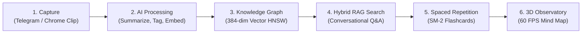

# Recall — Personal Knowledge OS & 3D Observatory

Recall turns your scattered notes, voice thoughts, articles, PDFs, and screenshots into an interconnected **3D Knowledge Constellation**. 

Capture anything on the fly via Telegram or web clipping. Recall automatically summarizes your content, extracts semantic tags, generates 384-dimensional vector embeddings, and builds a spatial mind map you can explore in 3D, search with conversational RAG, and master through spaced repetition flashcards.

---

## 🔄 How Recall Works



---

## 🌟 What Recall Lets You Do

* **Capture Anything Instantly**: Send voice notes, screenshots, PDFs, or article links to `@<YourBotUsername>` on Telegram or clip web pages with 1-click via the Chrome extension.
* **Never Lose Context**: Automatic AI summarization, entity extraction, and tag clustering keep your personal knowledge structured without manual effort.
* **Explore Your Mind in 3D**: Walk through a force-directed 3D constellation map of your thoughts (`/map`) or scroll through a spatial glass archive (`/archive`).
* **Ask Your Second Brain**: Query your knowledge using conversational RAG. Clicking answer citation badges (`[1]`, `[2]`) triggers smooth 3D camera auto-flight directly to cited nodes.
* **Remember What You Learn**: Turn your saved content into active recall flashcard drills (`/drill`) powered by the SuperMemo SM-2 spaced repetition algorithm.
* **Sync & Export Freely**: Full two-way sync with Obsidian vaults using Open Knowledge Format (OKF) Markdown files with YAML metadata.

---

## 🖼️ Interface Preview

| Room / Feature | Route | User Experience | Visual Preview |
|---|---|---|---|
| **Constellation Map** | `/map` | 60 FPS 3D force-directed node graph with semantic community hubs | `[ Screenshot Placeholder: 3D Constellation Map ]` |
| **Archive Cylinder** | `/archive` | Spatial glass cylinder browsing with smooth inertia scroll | `[ Screenshot Placeholder: Glass Archive Cylinder ]` |
| **Active Recall Drill** | `/drill` | Flashcard testing room with SuperMemo SM-2 interval feedback | `[ Screenshot Placeholder: Drill Flashcards ]` |
| **Chat Drawer (RAG)** | Global | Conversational RAG with interactive camera auto-flight badges | `[ Screenshot Placeholder: RAG Chat Drawer ]` |
| **Cognitive Profile** | `/profile` | Real-time mind portrait pulse score calculation and milestones | `[ Screenshot Placeholder: Profile & Pulse ]` |
| **Chrome Clipper** | Sidepanel | Manifest v3 1-click web clipping sidepanel | `[ Screenshot Placeholder: Chrome Clipper ]` |
| **Cognitive Bridges** | `/bridges` | Mind-pairing and Kintsugi gold crack decay simulation | `[ Screenshot Placeholder: Cognitive Bridges ]` |

---

## 📦 Technology Stack Overview

| Layer | Technology | Details |
|---|---|---|
| **Backend** | FastAPI 0.111+ | Python 3.11+, async routes, Pydantic BaseSettings |
| **Frontend** | React 18.3 + Vite 6.4 | JavaScript / JSX SPA, custom path-based router |
| **Styling** | Vanilla CSS | Custom Cyber-Noir / Glassmorphism design system |
| **Database** | Neon PostgreSQL 16 | Serverless pooled connection (`asyncpg`), 384-dim HNSW & GIN trigram indexes |
| **Queue** | Upstash Redis | REST client (`UpstashRedis`), async queue (`recall:tasks`), sliding rate limits |
| **3D Rendering** | Three.js / R3F | 60 FPS 3D constellation map (`/map`) and archive cylinder (`/archive`) |

---

## 🚀 Quick Start

### 1. Backend Setup
```bash
cd backend
python -m venv .venv

# On Windows:
.venv\Scripts\activate
# On Linux / macOS / Git Bash:
source .venv/bin/activate

pip install -r requirements.txt
cp .env.example .env.local
uvicorn backend.main:app --reload --port 8000
```

### 2. Frontend Setup (Separate Terminal)
```bash
cd frontend
npm install
npm run dev
```

### 3. Developer Commands (`Makefile`)
```bash
make dev-backend   # Start FastAPI server in reload mode (port 8000)
make dev-frontend  # Start Vite frontend dev server (port 5173)
make schema        # Run database schema initialization script on Neon PostgreSQL
make test          # Execute Pytest backend test suite (pytest -x -v)
make fernet        # Generate a fresh Fernet AES-128 base64 key
make jwt-secret    # Generate a fresh 32-byte hex JWT secret key
make tunnel        # Launch ngrok tunnel on port 8000 for Telegram testing
```

---

## 📁 Repository Structure

```
Recall/
├── backend/                    # FastAPI Backend Application (routes, services, db)
│   ├── config.py               # Central Pydantic BaseSettings environment validation
│   ├── main.py                 # FastAPI app initialization, middleware & lifespan setup
│   ├── worker.py               # Async worker loop consuming Redis task queue
│   ├── db/
│   │   ├── schema.sql          # Neon PostgreSQL schema definition
│   │   └── connection.py      # Asyncpg connection pool manager
│   ├── middleware/
│   │   └── twa_auth.py        # Telegram WebApp HMAC-SHA256 authentication
│   ├── routes/                # FastAPI routers (auth, api, bridges, webhook, websocket)
│   ├── scheduler/
│   │   └── scheduler.py       # APScheduler background cron jobs
│   └── services/              # Business logic services (AI, search, OCR, Redis, ingesters)
├── frontend/                   # React + Vite Frontend Application (SPA)
│   ├── src/
│   │   ├── main.jsx            # Entry point with Web Vitals & Telegram WebApp init
│   │   ├── App.jsx             # SPA custom router & observatory room shell
│   │   ├── canvas/             # 2D & 3D Three.js mind map canvas renderers
│   │   ├── components/         # Reusable UI components (Sidebar, ChatDrawer, SearchOverlay)
│   │   ├── context/            # AuthContext, ToastContext, SocketContext
│   │   └── pages/              # Observatory rooms (Archive, Map, Drill, Profile, Settings, Bridges)
├── docs/                       # Technical Documentation Suite
├── e2e/                        # Playwright end-to-end test suite
├── Makefile                    # Standardized CLI commands for local development
└── pytest.ini                  # Pytest configuration file
```

---

## 📜 License & Contribution

Recall is open-source software under the MIT License. Contributions are welcome! Please read the [Contributing Guidelines](docs/CONTRIBUTING.md) before submitting pull requests.

---

## 🔗 Technical Documentation Suite

[README.md](README.md) · [docs/INDEX.md](docs/INDEX.md) · [docs/ARCHITECTURE.md](docs/ARCHITECTURE.md) · [docs/DATABASE.md](docs/DATABASE.md) · [docs/API.md](docs/API.md) · [docs/FEATURES.md](docs/FEATURES.md)  
[docs/DEVELOPMENT.md](docs/DEVELOPMENT.md) · [docs/DEPLOYMENT.md](docs/DEPLOYMENT.md) · [docs/SECURITY.md](docs/SECURITY.md) · [docs/TESTING.md](docs/TESTING.md) · [docs/CONTRIBUTING.md](docs/CONTRIBUTING.md) · [docs/DIAGRAMS.md](docs/DIAGRAMS.md) · [docs/adr/README.md](docs/adr/README.md)
