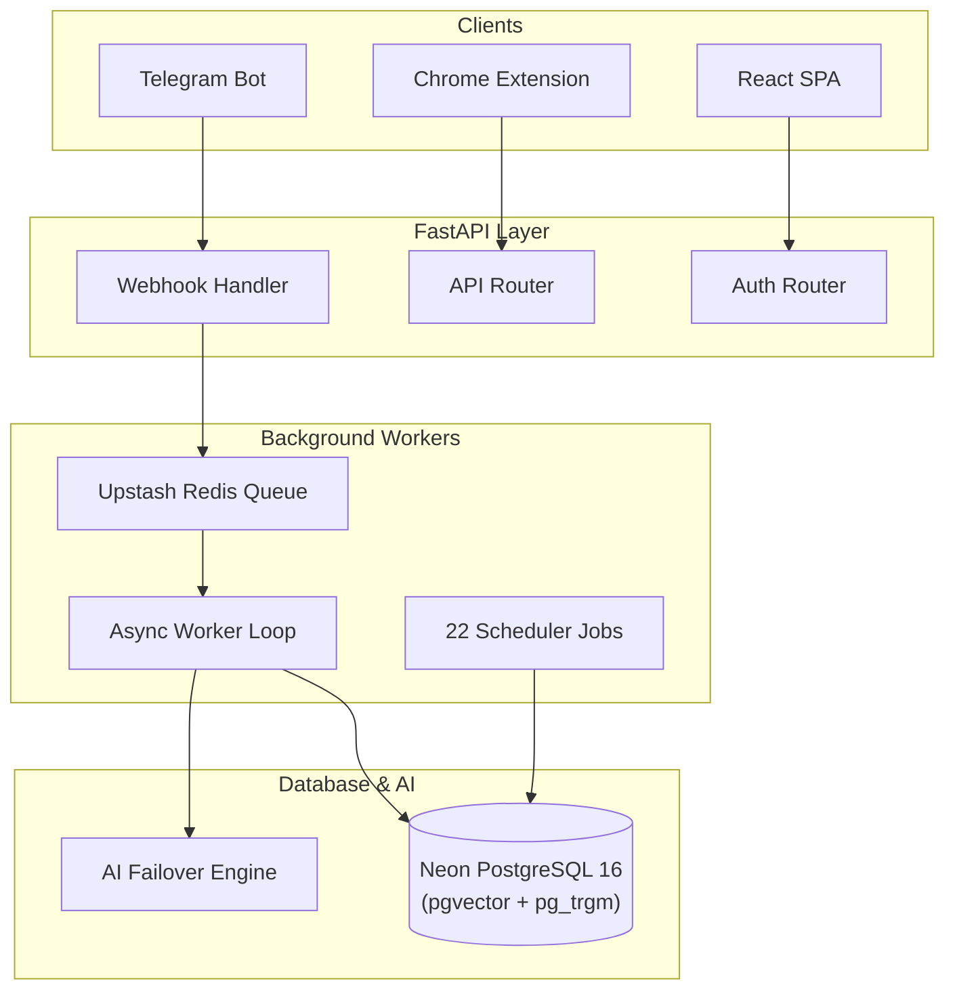

# Recall — Your Knowledge Belongs in 3D

> **Stop letting great articles, voice thoughts, and research die in unread tabs and static bookmark folders.**

Recall is a personal knowledge OS that captures anything you find—voice notes, PDFs, web links, screenshots—and turns it into an interactive, 3D spatial mind map you can explore, query with conversational RAG, and remember through active recall.

[](LICENSE)
[](https://python.org)
[](backend/main.py)
[](frontend/src/App.jsx)
[](backend/db/schema.sql)
[](docs/INDEX.md)

---

## 🖼️ Primary Interface Showcase

| Room / Interface | Experience | Visual Placeholder Specs |
|---|---|---|
| **3D Constellation Map** | 60 FPS force-directed spatial node graph with semantic community clustering | `[ Asset Placeholder: 3D Constellation Map ]`<br>*Aspect Ratio: 16:9 | Suggested Caption: Flying through semantic clusters in the 3D Observatory (`/map`)* |
| **Glass Archive Cylinder** | Spatial cylinder browsing with smooth inertia scroll and tag filtering | `[ Asset Placeholder: Archive Cylinder ]`<br>*Aspect Ratio: 16:9 | Suggested Caption: Scrolling through the glass archive cylinder (`/archive`)* |
| **Conversational RAG Chat** | Conversational Q&A drawer with interactive camera auto-flight badges | `[ Asset Placeholder: RAG Chat Drawer ]`<br>*Aspect Ratio: 16:9 | Suggested Caption: Clicking citation [1] triggers 3D camera flight directly to the source node* |
| **Active Recall Drill** | Spaced repetition flashcard testing room powered by SuperMemo SM-2 | `[ Asset Placeholder: Flashcard Drill ]`<br>*Aspect Ratio: 16:9 | Suggested Caption: Testing active recall retention with interval ratings (`/drill`)* |

---

## 💭 The Problem

We consume dozens of valuable ideas every day:

* A 45-minute technical podcast listened to while walking
* A deep-dive PDF paper saved on a laptop
* A code snippet or tweet bookmarked late at night
* A quick voice thought recorded on a phone

Within 48 hours, **80% of what we saved is forgotten or lost in unorganized tabs**. Traditional note apps force you to manually tag, sort into folder hierarchies, and write manual summaries. The result? Capture friction, tagging burnout, and static notes that are never read again.

---

## 💡 The Solution: Knowledge as a Journey

Recall turns passive saving into an active, visual, and memorable workflow.

```
┌─────────────────┐      ┌─────────────────┐      ┌─────────────────┐      ┌─────────────────┐      ┌─────────────────┐
│   1. CAPTURE    │ ───► │   2. PROCESS    │ ───► │   3. CONNECT    │ ───► │    4. SEARCH    │ ───► │   5. REMEMBER   │
│ Telegram / Web  │      │ AI Summarization│      │ 384-dim Embed   │      │ Hybrid RAG Q&A  │      │ SM-2 Flashcards │
└─────────────────┘      └─────────────────┘      └─────────────────┘      └─────────────────┘      └─────────────────┘
```

### Step 1: Capture Instantly
Send a voice note, screenshot, PDF, or article link to `@<YourBotUsername>` on Telegram, or click 1-button save in the Chrome extension. No manual forms, no mandatory fields.

`[ GIF Placeholder: Telegram & Chrome Web Clipping ]`<br>*Recommended Spec: 800x450 GIF showing 1-click web save and Telegram voice note drop*

### Step 2: Automatic Processing
The background worker extracts raw text, executes OCR on images, transcribes voice notes with Whisper, sanitizes entities, and generates structured summaries.

### Step 3: Spatial Connections
Content is converted into 384-dimensional vector embeddings and indexed in Neon PostgreSQL using `pgvector` HNSW. Related thoughts automatically pull together into visual 3D clusters.

`[ GIF Placeholder: 3D Constellation Navigation ]`<br>*Recommended Spec: 800x450 GIF showing smooth camera rotation and node hover cards in Three.js*

### Step 4: Conversational Search
Query your knowledge base in plain English. Recall retrieves relevant chunks using Reciprocal Rank Fusion (RRF) and generates an answer with interactive citation badges `[1]`, `[2]`.

`[ GIF Placeholder: RAG Camera Auto-Flight ]`<br>*Recommended Spec: 800x450 GIF showing citation click triggering 3D camera auto-flight*

### Step 5: Active Recall Mastery
Saved items automatically transform into flashcard drills. Rate your memory retention (Again, Shaky, Locked) to let the SuperMemo SM-2 algorithm schedule your next review interval.

---

## 🌟 Feature Showcase

### 📱 Capture Anywhere
> *Save thoughts in seconds without interrupting your flow.*

`[ Asset Placeholder: Multi-Source Capture ]`<br>*Recommended Spec: 16:9 Image | Caption: Saving voice, text, PDFs, and web clips via Telegram and Chrome extension*

* **Telegram Bot**: Send voice notes, screenshots, PDFs, or links to `@<YourBotUsername>`.
* **Chrome Extension**: Manifest v3 sidepanel for 1-click web clipping (`/api/extension/save`).
* **Audio & OCR**: Whisper audio transcription and Hugging Face PaddleOCR image text extraction.

---

### 🌌 3D Observatory Map
> *Explore your second brain as a living, spatial constellation.*

`[ Asset Placeholder: 3D Constellation Cluster ]`<br>*Recommended Spec: 16:9 Image | Caption: 60 FPS Three.js force-directed graph with semantic community hubs*

* **60 FPS Rendering**: Built with Three.js / React Three Fiber.
* **Semantic Clustering**: Nodes cluster based on mathematical cosine vector similarity.
* **Archive Cylinder**: Spatial glass cylinder for chronological and filter-based archive browsing (`/archive`).

---

### 💬 Conversational RAG & Camera Flight
> *Ask questions and fly directly to the source of your thoughts.*

`[ Asset Placeholder: Conversational RAG ]`<br>*Recommended Spec: 16:9 Image | Caption: Interactive citation badges trigger 3D camera auto-flight to source nodes*

* **Hybrid Search (RRF)**: Combines `pgvector` 384-dim HNSW cosine vector search and `pg_trgm` GIN trigram text search.
* **Multi-Tier RAG**: OpenRouter -> NVIDIA NIM -> Gemini failover pipeline.
* **Camera Auto-Flight**: Clicking answer citations smoothly navigates the 3D canvas to the exact source node.

---

### 🎴 Spaced Repetition (SM-2)
> *Turn static bookmarks into memories you actually keep.*

`[ Asset Placeholder: Flashcard Drill Room ]`<br>*Recommended Spec: 16:9 Image | Caption: Active recall flashcards with SuperMemo SM-2 interval calculations (`/drill`)*

* **SuperMemo SM-2**: Automated interval scheduling based on user memory confidence ratings.
* **Dynamic Quiz Generation**: Questions automatically extracted from your saved content.

---

### 📝 Obsidian OKF Sync
> *Own your data with transparent two-way vault synchronization.*

`[ Asset Placeholder: Obsidian Vault Sync ]`<br>*Recommended Spec: 16:9 Image | Caption: Open Knowledge Format (OKF) Markdown zip import and export*

* **Open Knowledge Format (OKF)**: Markdown files with standard YAML metadata.
* **Import & Export**: ZIP import (`POST /api/import/zip`) and export (`GET /api/export/zip`).

---

## ⚡ How It Works (High-Level Architecture)



> 📖 *For complete sequence diagrams, background queue mechanics, and lifecycles, visit the [System Architecture Guide](docs/ARCHITECTURE.md).*

---

## 📊 Traditional Notes vs. Recall

| Capability | Traditional Note Apps | Recall |
|---|---|---|
| **Friction** | Manual titles, tags, and folder organization | Zero-friction capture via Telegram & Chrome extension |
| **Search** | Exact keyword matching only | Hybrid Vector (HNSW) + Trigram (GIN) with Reciprocal Rank Fusion |
| **Navigation** | Static lists and nested folders | Interactive 60 FPS 3D spatial constellation map |
| **RAG Answers** | Text-only output | Interactive answer citations with 3D camera auto-flight |
| **Retention** | Saved and forgotten forever | Active recall flashcards scheduled via SuperMemo SM-2 |
| **Security** | Plaintext database storage | Fernet AES-128 cryptographic encryption at rest |

---

## ⚡ Quick Start

Get Recall running locally in under 3 minutes.

### 1. Clone & Backend Setup

```bash
git clone https://github.com/PriyanshuG27/Recall.git
cd Recall/backend

# Create virtual environment
python -m venv .venv

# Activate environment (Windows: .venv\Scripts\activate | Linux/macOS: source .venv/bin/activate)
source .venv/bin/activate

# Install requirements and configure environment
pip install -r requirements.txt
cp .env.example .env.local

# Run FastAPI server
uvicorn backend.main:app --reload --port 8000
```

### 2. Frontend Setup (Separate Terminal)

```bash
cd Recall/frontend
npm install
npm run dev
```

Open `http://localhost:5173` in your browser.

> 🛠️ *For full Makefile commands, database schema scripts, and environment variable references, visit the [Development Guide](docs/DEVELOPMENT.md).*

---

## 🛠️ Technology Stack

| Component | Technology | Source Link |
|---|---|---|
| **Backend API** | FastAPI 0.111+ (Python 3.11+) | [main.py](backend/main.py) |
| **Frontend SPA** | React 18.3 + Vite 6.4 (Vanilla CSS) | [App.jsx](frontend/src/App.jsx) |
| **3D Rendering** | Three.js / React Three Fiber | [MapCanvas.jsx](frontend/src/canvas/MapCanvas.jsx) |
| **Database** | Neon PostgreSQL 16 (15 tables) | [schema.sql](backend/db/schema.sql) |
| **Vector Search** | `pgvector` (384-dim HNSW cosine) | [search_service.py](backend/services/search_service.py) |
| **Text Search** | `pg_trgm` (GIN trigram index) | [schema.sql](backend/db/schema.sql) |
| **Task Queue** | Upstash Redis (`recall:tasks`) | [worker.py](backend/worker.py) |
| **Backend Hosting** | Koyeb Serverless (FastAPI + FastEmbed ONNX) | [DEPLOYMENT.md](docs/DEPLOYMENT.md) |
| **GPU Serverless** | Modal GPU (Whisper + Qwen LLM) | [ai_cascade.py](backend/services/ai_cascade.py) |

---

## 📖 Technical Documentation Library

Recall features a comprehensive, repository-backed documentation suite:

* 🚀 [System Architecture Guide](docs/ARCHITECTURE.md) — System design, sequence diagrams, and lifecycles.
* 🗄️ [Database Reference](docs/DATABASE.md) — DDL schemas, `pgvector` HNSW indexes, and production SQL queries.
* 🔌 [API Endpoint Reference](docs/API.md) — Complete specification for all 50 FastAPI REST & WebSocket endpoints.
* 🌟 [Feature Specifications Matrix](docs/FEATURES.md) — Feature status breakdown across production, dev, and legacy.
* 🛠️ [Development & Contributor Guide](docs/DEVELOPMENT.md) — Environment setup, `Makefile` targets, and contributor workflows.
* ☁️ [Deployment Guide](docs/DEPLOYMENT.md) — Hosting setup (Koyeb, Vercel, Modal) and 27 environment variables.
* 🛡️ [Security Architecture](docs/SECURITY.md) — Cryptography, Fernet AES-128, HMAC verification, and PII masking.
* 🧪 [Testing Strategy](docs/TESTING.md) — Test pyramid breakdown across 151 test files.
* 🤝 [Contributing Guidelines](docs/CONTRIBUTING.md) — Coding standards, workspace rules, and PR checklist.
* 📊 [Visual Diagrams Matrix](docs/DIAGRAMS.md) — 10 code-derived Mermaid diagrams.
* 📋 [Architecture Decision Records (ADRs)](docs/adr/README.md) — Formal records (`ADR-001` through `ADR-006`).

---

## 🤝 Contributing

Contributions are welcome! Please read the [Contributing Guidelines](docs/CONTRIBUTING.md) before submitting pull requests.

1. Fork the repository
2. Create your feature branch (`git checkout -b feature/amazing-feature`)
3. Commit your changes (`git commit -m 'feat: add amazing feature'`)
4. Push to the branch (`git push origin feature/amazing-feature`)
5. Open a Pull Request

---

## 📜 License

Recall is open-source software released under the MIT License.
