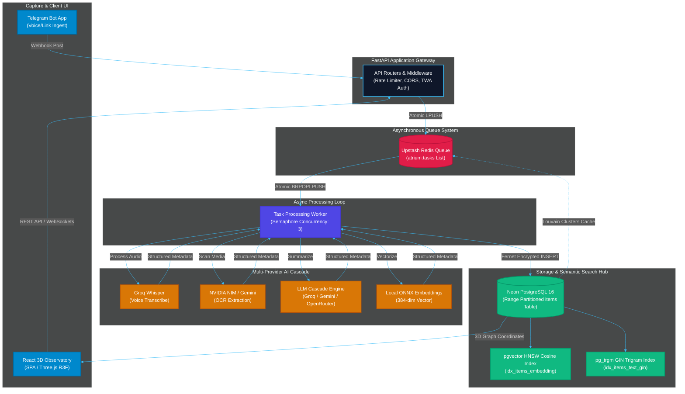

# Atrium

### Your second brain should remember for you.

Atrium captures ideas from anywhere, organizes them automatically, lets you explore them visually, and helps you remember them over time.

[](LICENSE)
[](backend/requirements.txt)
[](backend/main.py)
[](frontend/package.json)
[](backend/db/schema.sql)

---

## Atrium at a Glance

*   **⚡ Ingest from Anywhere**: Send voice notes, links, PDFs, or photos to a Telegram bot.
*   **🌌 3D Constellations**: Explore your knowledge graph in a spatial three-dimensional map.
*   **💬 Chat with Context**: Query your mind using a built-in RAG assistant.
*   **🎴 Spaced Repetition**: Retain saved insights with SM-2 quizzes.
*   **🔒 Complete Ownership**: Self-hostable, backed by PostgreSQL, with simple Markdown imports and exports.

---

## 🎬 The Experience

```text
┌───────────────────────────────────────────────────────────────────────────┐
│                                                                           │
│                      [ 🌌 3D Spatial Constellation ]                       │
│                                                                           │
│          ● (Machine Learning)                                             │
│         /  \                                                              │
│  ● (Math)    ● (FastAPI) ─── ● (RAG Search)                               │
│               \             /                                             │
│                ● ─── ● ─── ● (Three.js Viewport)                          │
│                                                                           │
│  Camera Pilot Mode: Ask a question in the chat drawer ──► Click citation  │
│  badge ──► Viewport interpolates and flies directly to the source node.   │
│                                                                           │
└───────────────────────────────────────────────────────────────────────────┘
```
*(Demonstration recording coming soon)*

---

## The Workflow Shift

Traditional personal knowledge management systems (Obsidian, Notion, Logseq) require continuous organization. Atrium automates the friction away.

| Action | Traditional PKM | The Atrium Way |
|---|---|---|
| **Save** | Create a file, name it, and save | Send a Telegram message |
| **Structure** | Create folders and link notes manually | AI organizes them automatically in 3D |
| **Retrieve** | Search for keywords | Ask a question in natural language |
| **Explore** | Scroll through list files | Fly through relationships visually |
| **Retain** | Forget later | Automated scheduled quizzes |

---

## Why Atrium Exists (Philosophy)

*   **Frictionless capture is essential.** If saving a thought takes more than two seconds, you won't do it. Telegram provides a zero-friction input gateway.
*   **Brains are spatial computers.** Lists and grids do not match how we think. Navigating concepts spatially in a three-dimensional coordinate graph matches our neural mapping.
*   **Saving does not equal knowing.** Gathering bookmarks creates an illusion of competence. Active recall is the only way to build long-term retention.

---

## Feature Showcase

### 1. Zero-Friction Ingestion
```text
┌─────────────────────────────────────────────────────────┐
│ Telegram Bot                                            │
│ User: https://arxiv.org/abs/2305.16261                  │
│ Bot: 📥 Link Captured! "RAG: Retrieval-Augmented..."    │
│      💡 How do you plan to apply this search pattern?   │
└─────────────────────────────────────────────────────────┘
```
Send links, voice notes, PDFs, or photos. Atrium acknowledges the upload instantly, then asks a single targeted follow-up question in your chosen psychological mood to deepen retention.
*(Screenshots coming soon)*

### 2. Conversational RAG & Camera Pilot
Ask your database questions. The RAG assistant answers using your notes as context. Click any citation badge (`[1]`) in the chat drawer to trigger a camera fly-to animation that pilots the camera straight to the cited node.
*(Screenshots coming soon)*

### 3. Interactive 3D Observatory
Navigate your thoughts. View notes clustered into colored communities by semantic similarity in a force-directed 3D graph, or browse cards chronologically in a 3D cylindrical carousel.
*(Screenshots coming soon)*

### 4. Active Retention Quizzes (SM-2)
```text
┌─────────────────────────────────────────────────────────┐
│ Drill Room                                              │
│ Question: What is the main bottleneck in RAG pipelines? │
│ [Show Answer] ──► Select Confidence:                    │
│ [ Again (0d) ]   [ Shaky (1d) ]   [ Locked (6d) ]       |
└─────────────────────────────────────────────────────────┘
```
Keep saved ideas fresh. The system generates flashcards and schedules reviews. You select your retention rating to update the card's next review date.
*(Screenshots coming soon)*

---

## How It Works

Atrium processes notes asynchronously to ensure instantaneous webhook responses:

```
Capture ──► Understand ──► Connect ──► Explore ──► Remember
```

1.  **Capture**: Webhooks receive the Telegram message and immediately write it to the task queue.
2.  **Understand**: Workers transcribes audio, parse documents, run OCR, and extract summaries.
3.  **Connect**: The system generates vector embeddings, mapping the summaries to coordinates in our 3D graph.
4.  **Explore**: The new note is pushed to active WebSockets, rendering instantly in the frontend viewports.
5.  **Remember**: Scheduled tasks queue items for your active review quizzes during offpeak hours.

---

## Technical Architecture

Atrium separates API gateways from heavy processing worker queues to protect webhooks from timeouts.



For detailed specifications, see the [Architecture Overview](docs/architecture/overview.md).

---

## Technology Stack

| Layer | Technologies | Purpose |
|---|---|---|
| **Frontend** | React 18, Three.js, React Three Fiber, GSAP, Tone.js | Smooth 3D constellation viewports and sound design |
| **Backend** | FastAPI, uvicorn, psycopg3, Pydantic, APScheduler | REST APIs and background scheduled tasks |
| **Database** | Neon PostgreSQL 16, pgvector, pg_trgm | Relational storage, vector searches, and fuzzy text matches |
| **Cache & Queue** | Upstash Redis (REST compatibility) | Task queue, sliding rate-limits, and graph cache |
| **AI Pipelines** | Groq Whisper, NVIDIA NIM OCR, Google Gemini, FastEmbed | Transcription, fallback OCR, LLM cascade summaries |

---

## Repository Structure

```text
Atrium/
├── backend/            # FastAPI application, database schemas, and queue workers
├── frontend/           # React single page app and Three.js canvas engines
├── docs/               # Technical documentation library
│   ├── getting-started/# Guides for setting up bots, workspaces, and envs
│   ├── product/        # Features, RAG, search, and troubleshooting guides
│   ├── architecture/   # Diagrams, database, caching, and security specs
│   └── development/    # API routes, testing, setup, and contributing guides
├── scripts/            # Database seeding and developer tools
└── Makefile            # Local execution and build shortcuts
```

---

## Quick Start

### 1. Prerequisites
Ensure you have the following installed:
- Python 3.11+
- Node.js 18+ with `npm`
- PostgreSQL (with `pgvector` and `pg_trgm` extensions)
- Redis instance

### 2. Backend Setup
```bash
git clone https://github.com/PriyanshuG27/Atrium.git
cd Atrium/backend

# Create virtual environment and install dependencies
python -m venv .venv
source .venv/bin/activate  # Windows: .venv\Scripts\activate
pip install -r requirements.txt

# Configure environment and run DDL migrations
cp .env.example .env.local
make schema

# Start FastAPI server
make dev-backend
```

### 3. Frontend Setup
In a new terminal window, navigate to the frontend directory:
```bash
cd Atrium/frontend
npm install

# Start development server
make dev-frontend
```
Open `http://localhost:5173` in your browser.

---

## Documentation Directory

| Guide Category | Description |
|---|---|
| **[INDEX Hub](docs/INDEX.md)** | Technical navigation table of contents for all active documentation. |
| **[Getting Started](docs/getting-started/installation.md)** | Guides for installing dependencies, bot creation, and environment variables. |
| **[Product Specs](docs/product/overview.md)** | Detailed pages on search, quizzes, chat drawers, and troubleshooting. |
| **[Architecture Details](docs/architecture/overview.md)** | Structural manuals for databases, caches, security, and authentication. |
| **[Development Manual](docs/development/setup.md)** | API routes, testing strategies, coding standards, and deployment. |

---

## Project Roadmap

*   **Current State**: Multi-modal ingestion, 3D spatial observatory constellation, conversational RAG, SM-2 flashcard drills, Hearth partnerships, and OKF ZIP backups.
*   **Upcoming**: Direct Obsidian vault sync plugin, local offline LLM options, and Chrome web clipper integrations.
*   **Long-Term Vision**: Collaborative multi-user graphs, automated document graph linking, and advanced mind-mapping rooms.

---

## Contributing

Contributions are welcome. Please refer to our [Contributing Guidelines](docs/development/contributing.md) for pull request verification checklists, testing standards, and development requirements.

---

## License

Atrium is open-source software licensed under the [MIT License](LICENSE).
