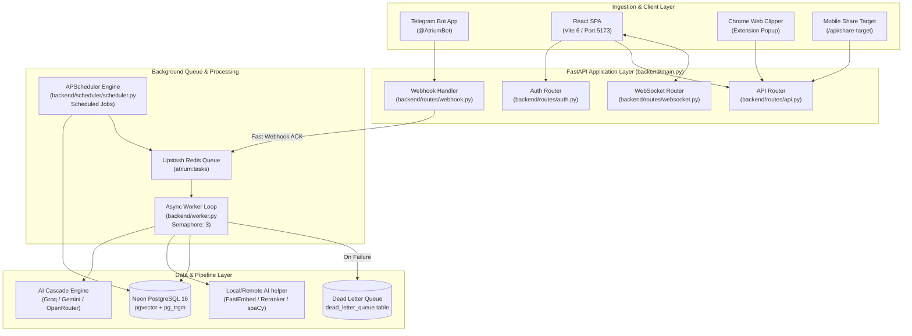
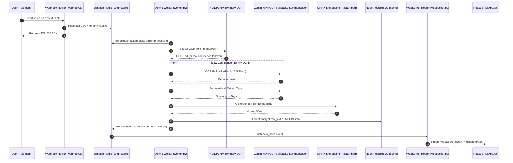
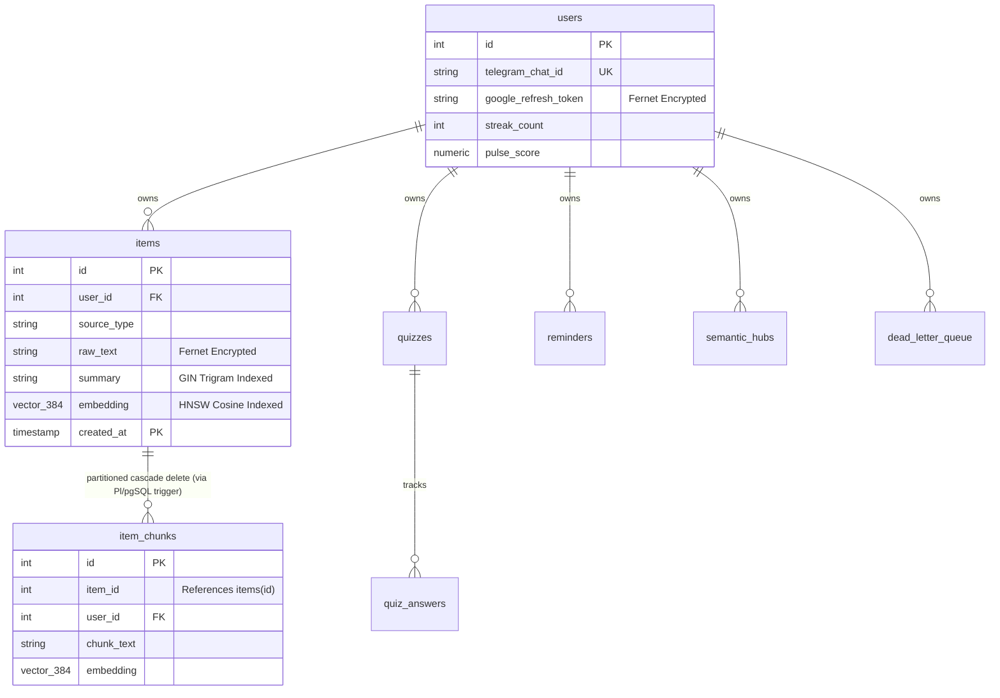

---
Last Verified
Repository: Atrium
Branch: main
Commit: 5d4b39561d30e5c63fd7aae34991ceb3c0b8f072
Verification Date: 2026-07-12
---

# Visual Architecture Diagrams

This document contains visual Mermaid diagrams explaining Atrium's component layering, content ingestion pipelines, and database relations.

---

## 1. System Architecture & Components
This diagram maps client endpoints, API routers, background workers, and datastores:

---

## 2. Ingestion Sequence Diagram
This diagram outlines the sequential steps when a user uploads content via Telegram:

---

## 3. Database Entity-Relationship (ER) Diagram
This diagram visualizes database tables and relationships. Note that composite range-partitioned primary keys in `items` restrict standard foreign keys in target tables:

---

## Evidence & Inspected Files
This document was generated from:
- `backend\main.py`
  - Core app structure.
- `backend\worker.py`
  - Queue worker setup.
- `backend\db\schema.sql`
  - Mapped tables DDL structure.
- `docs\archive\DIAGRAMS.md`
  - Historical diagrams context.
